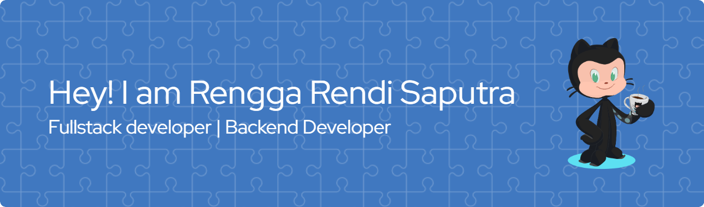

<h1>Hi there 👋, I'm Rengga Rendi Saputra</h1>

### Tentang Saya

Saya adalah mahasiswa S1 Teknik Informatika di Universitas Negeri Surabaya dengan IPK 3.69. Saya memiliki minat besar di bidang **pengembangan web**, khususnya **backend development**. Selama kuliah dan pelatihan, saya aktif mengembangkan berbagai proyek, mulai dari aplikasi web realtime hingga RESTful API, dengan teknologi seperti Node.js, Express, Next.js, Prisma, dan Laravel.

### Tech Stack
                   

###

<h2 align="left">Play Game With Me</h2>

###

###